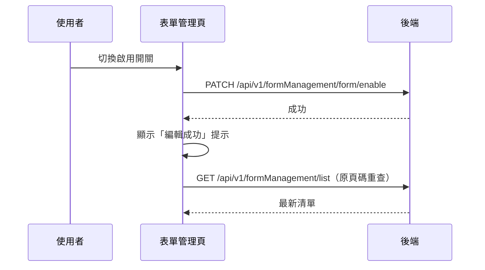

## 啟用／停用表單

**觸發**：表單管理頁清單列上的啟用開關
`src/views/Form/Management/IndexView.vue:373`

這是清單頁上唯一**不開視窗、直接寫入**的動作：勾一下就生效。

### 步驟

1. **反轉該表單的啟用狀態並送出** `src/views/Form/Management/IndexView.vue:167-170`
   帶 `formGid` 與反轉後的 `enable`
   → `PATCH /api/v1/formManagement/form/enable`（**寫入**） `src/api/form.ts:96`。
   期間掛上載入狀態 `src/views/Form/Management/IndexView.vue:168`。

2. **成功後顯示「編輯成功」提示，並重查清單** `src/views/Form/Management/IndexView.vue:171-172`
   先提示、再重查；重查帶著目前頁碼 `getFormListHandler(query.page)`，
   使用者停留在原本那一頁，走〈查詢表單清單〉同一條路徑
   → `GET /api/v1/formManagement/list` `src/api/form.ts:58`。

3. **解除載入狀態** `src/views/Form/Management/IndexView.vue:174`

### 序列圖

### 資料變化

| 對象 | 動作 | 位置 |
|---|---|---|
| `PATCH /api/v1/formManagement/form/enable` | **寫入**，反轉表單啟用狀態 | `src/api/form.ts:96` |
| `GET /api/v1/formManagement/list` | 唯讀，寫入後重查 | `src/api/form.ts:58` |
| 提示 Store | 顯示成功訊息 | `src/views/Form/Management/IndexView.vue:171` |
| 載入 Store | 掛上與解除 | `src/views/Form/Management/IndexView.vue:168` |

### 異常與補償

- 寫入 API 沒有 try／catch，失敗由全域 API 回應攔截器統一顯示錯誤（見全域前置）。
- 失敗時不顯示成功提示、不重查，`await` 中斷後「解除載入狀態」
  `src/views/Form/Management/IndexView.vue:174` 不會執行，依賴攔截器的清空載入狀態安全網；
  清單維持原資料，與後端一致，使用者可直接重試。

### 全域前置

授權標頭注入與錯誤顯示見〈每個請求送出前〉與〈API 錯誤的全域處理〉。
