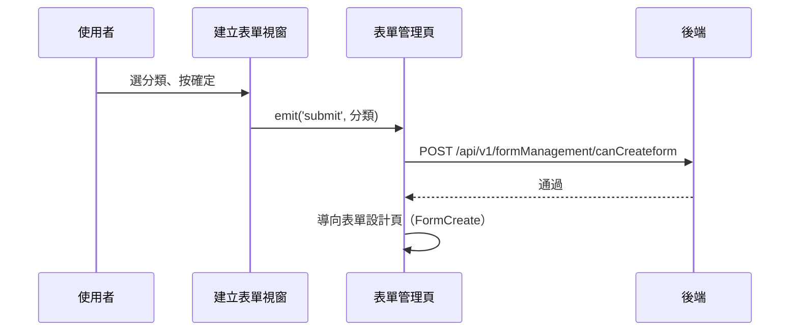

## 建立自訂表單（資格檢查後進入設計頁）

**觸發**：表單管理頁的「建立自訂表單」視窗選好表單分類後按確定
`src/views/Form/Management/components/CreateCustomFormModal.vue:63`

這條流程**不會直接建立表單**——它先向後端確認「這個機構還能不能建這類表單」，
通過才把使用者送進表單設計頁；真正的建立發生在設計頁按儲存時（見〈儲存表單設計〉）。

### 步驟

1. **視窗驗證已選分類，往父層發事件** `src/views/Form/Management/components/CreateCustomFormModal.vue:51-55`
   未選分類直接擋下（`formCategory === null` 就 return）；有選才
   `emit('submit', formCategory)`。

2. **父層向後端確認建立資格** `src/views/Form/Management/IndexView.vue:210-215`
   跨元件延續：submit 事件接到 `toCreateCustomFormPage`
   `src/views/Form/Management/IndexView.vue:493`。
   帶 `organizationId` 與分類
   → `POST /api/v1/formManagement/canCreateform` `src/api/form.ts:596`。
   期間掛上載入狀態。封包依 POST 動詞標為**寫入**，但從呼叫端看，
   它的回應只拿來決定要不要導頁；是否在後端留下資料，前端程式碼看不出來。

3. **通過才導向表單設計頁** `src/views/Form/Management/IndexView.vue:214`
   `router.push` 到 `FormCreate`，網址帶著 `orgId` 與 `formCategory`，
   設計頁據此知道要為哪個機構建哪類表單。

### 序列圖

### 資料變化

| 對象 | 動作 | 位置 |
|---|---|---|
| `POST /api/v1/formManagement/canCreateform` | 資格檢查（封包標寫入，見步驟 2 說明） | `src/api/form.ts:596` |
| 導頁 | 前往 FormCreate，query 帶 orgId 與分類 | `src/views/Form/Management/IndexView.vue:214` |
| 載入 Store | 掛上與解除 | `src/views/Form/Management/IndexView.vue:211` |

### 異常與補償

- 資格檢查沒有 try／catch，失敗由全域 API 回應攔截器統一顯示錯誤（見全域前置）。
- 檢查不通過（API 回錯誤）就**不導頁**，使用者留在原視窗；`await` 中斷後
  「解除載入狀態」`src/views/Form/Management/IndexView.vue:216` 不會執行，
  依賴攔截器的清空載入狀態安全網。

### 全域前置

授權標頭注入與錯誤顯示見〈每個請求送出前〉與〈API 錯誤的全域處理〉。
