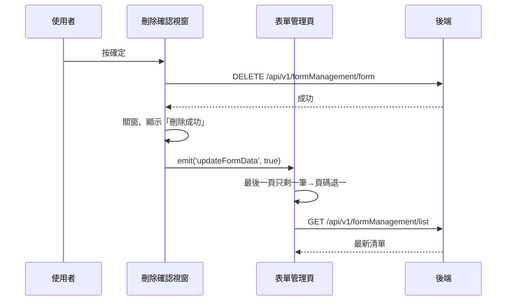

## 刪除表單

**觸發**：表單管理頁的「刪除表單」確認視窗按確定
`src/views/Form/Management/components/DeleteFormModal.vue:101`

### 步驟

1. **送出刪除** `src/views/Form/Management/components/DeleteFormModal.vue:84-87`
   表單驗證通過後（`handleSubmit` 包裹）
   → `DELETE /api/v1/formManagement/form`（**寫入**） `src/api/form.ts:89`。
   期間以視窗自己的載入鍵掛上載入狀態。

2. **成功後關窗、提示、通知父層重查** `src/views/Form/Management/components/DeleteFormModal.vue:87-90`
   關閉視窗、顯示「刪除成功」提示，`emit('updateFormData', true)` 通知父層——
   `true` 代表這是刪除，父層要據此調整頁碼。

3. **父層重算頁碼後重查清單** `src/views/Form/Management/IndexView.vue:251-257`
   跨元件延續：事件接到 `updateFormListHandler` `src/views/Form/Management/IndexView.vue:504`，
   經 `updateList` `src/utils/functions/execute.ts:16-22` 判斷：
   **若刪掉的是最後一頁僅剩的一筆，自動退到前一頁**，避免重查後停在空頁。
   然後走〈查詢表單清單〉同一條路徑
   → `GET /api/v1/formManagement/list` `src/api/form.ts:58`。

### 序列圖

### 資料變化

| 對象 | 動作 | 位置 |
|---|---|---|
| `DELETE /api/v1/formManagement/form` | **寫入**，刪除表單 | `src/api/form.ts:89` |
| `GET /api/v1/formManagement/list` | 唯讀，刪除後重查 | `src/api/form.ts:58` |
| 提示 Store | 顯示成功訊息 | `src/views/Form/Management/components/DeleteFormModal.vue:88` |
| 載入 Store | 視窗與父層各自掛上與解除 | `src/views/Form/Management/components/DeleteFormModal.vue:85` |

### 異常與補償

- 刪除 API 沒有 try／catch，失敗由全域 API 回應攔截器統一顯示錯誤（見全域前置）。
- 失敗時不關窗、不提示、不發事件，父層不重查；清單維持原狀與後端一致，可直接重試。
  視窗的「解除載入狀態」在 `await` 之後，失敗時不會執行，依賴攔截器安全網。

### 全域前置

授權標頭注入與錯誤顯示見〈每個請求送出前〉與〈API 錯誤的全域處理〉。
