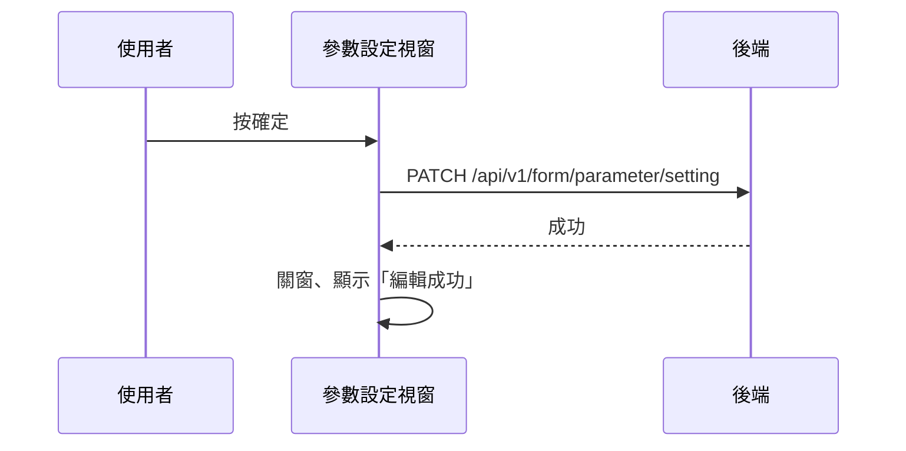

## 更新表單參數設定

**觸發**：「表單參數設定」視窗按確定
`src/views/Form/Management/components/UpdateFormParameterModal.vue:131`

### 步驟

1. **送出參數對照** `src/views/Form/Management/components/UpdateFormParameterModal.vue:110-118`
   帶 `formGid` 與參數清單（**只送有填值的**，`parameter === null` 的項目被濾掉）
   → `PATCH /api/v1/form/parameter/setting`（**寫入**） `src/api/form.ts:128`。
   期間以視窗自己的載入鍵掛上載入狀態。

2. **成功後關窗、顯示「編輯成功」提示** `src/views/Form/Management/components/UpdateFormParameterModal.vue:119-120`
   這個視窗**不通知父層重查**——沒有發任何事件，表單清單維持原樣。

3. **解除載入狀態** `src/views/Form/Management/components/UpdateFormParameterModal.vue:122`

### 序列圖

### 資料變化

| 對象 | 動作 | 位置 |
|---|---|---|
| `PATCH /api/v1/form/parameter/setting` | **寫入**，更新欄位參數對照 | `src/api/form.ts:128` |
| 提示 Store | 顯示成功訊息 | `src/views/Form/Management/components/UpdateFormParameterModal.vue:120` |
| 載入 Store | 掛上與解除 | `src/views/Form/Management/components/UpdateFormParameterModal.vue:113` |

### 異常與補償

- 寫入 API 沒有 try／catch，失敗由全域 API 回應攔截器統一顯示錯誤（見全域前置）。
- 失敗時不關窗、不提示，`await` 中斷後「解除載入狀態」不會執行，依賴攔截器安全網；
  視窗維持原輸入，可直接重試。
- 視窗沒拿到表單資料（`props.formData` 未定義）時直接 return，什麼都不做
  `src/views/Form/Management/components/UpdateFormParameterModal.vue:111`。

### 全域前置

授權標頭注入與錯誤顯示見〈每個請求送出前〉與〈API 錯誤的全域處理〉。
