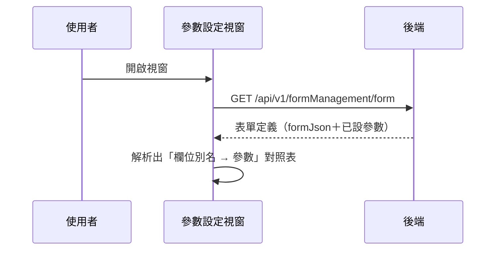

## 開啟表單參數設定視窗（載入現有參數）

**觸發**：表單管理頁開啟「表單參數設定」視窗
`src/views/Form/Management/components/UpdateFormParameterModal.vue:132`

### 步驟

1. **取得該表單的完整定義** `src/views/Form/Management/components/UpdateFormParameterModal.vue:77-91`
   帶 `formGid` → `GET /api/v1/formManagement/form`（讀取） `src/api/form.ts:84`。
   期間以視窗自己的載入鍵掛上載入狀態，並先清空畫面上的參數清單。

2. **從表單定義建出參數清單** `src/views/Form/Management/components/UpdateFormParameterModal.vue:92-107`
   解析回傳的 `formJson`，走訪每個題組的元素，取出有 `alias` 的欄位，
   並對回已設定的 `parameter` 值——這就是視窗裡可編輯的「欄位別名 → 參數」對照表。

### 序列圖

### 資料變化

| 對象 | 動作 | 位置 |
|---|---|---|
| `GET /api/v1/formManagement/form` | 唯讀 | `src/api/form.ts:84` |
| 載入 Store | 掛上與解除 | `src/views/Form/Management/components/UpdateFormParameterModal.vue:78` |

### 異常與補償

- 查詢沒有 try／catch，失敗由全域 API 回應攔截器統一顯示錯誤（見全域前置）。
- 若視窗沒拿到表單資料（`props.formData` 未定義），會直接丟出本地錯誤
  `src/views/Form/Management/components/UpdateFormParameterModal.vue:81`；
  這條路徑與 API 失敗一樣，「解除載入狀態」不會執行，依賴攔截器安全網。

### 全域前置

授權標頭注入與錯誤顯示見〈每個請求送出前〉與〈API 錯誤的全域處理〉。
