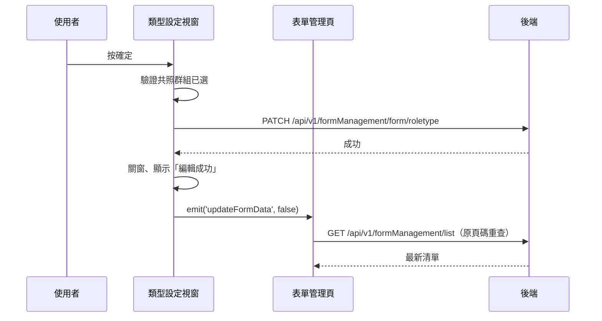

## 變更表單類型與共照群組篩選

**觸發**：「表單類型設定」視窗按確定
`src/views/Form/Management/components/UpdateFormTypeModal.vue:120`

### 步驟

1. **前端驗證共照群組** `src/views/Form/Management/components/UpdateFormTypeModal.vue:87-93`
   若勾了「啟用共照群組篩選」卻一個群組都沒選，標記欄位錯誤並擋下，不打後端。

2. **送出類型變更** `src/views/Form/Management/components/UpdateFormTypeModal.vue:95-105`
   帶 `formGid`、`roleType`、是否啟用共照群組篩選與群組清單
   → `PATCH /api/v1/formManagement/form/roletype`（**寫入**）
   `src/views/Form/Management/components/UpdateFormTypeModal.vue:96`。
   期間以視窗自己的載入鍵掛上載入狀態。

3. **成功後關窗、提示、通知父層重查** `src/views/Form/Management/components/UpdateFormTypeModal.vue:107-109`
   顯示「編輯成功」，`emit('updateFormData', false)`——`false` 代表不是刪除，
   父層重查時**頁碼不變**。

4. **父層重查清單** `src/views/Form/Management/IndexView.vue:251-257`
   跨元件延續：事件接到 `updateFormListHandler` `src/views/Form/Management/IndexView.vue:498`，
   經 `updateList` `src/utils/functions/execute.ts:16-22` 決定頁碼（非刪除，維持原頁），
   走〈查詢表單清單〉同一條路徑 → `GET /api/v1/formManagement/list` `src/api/form.ts:58`。

### 序列圖

### 資料變化

| 對象 | 動作 | 位置 |
|---|---|---|
| `PATCH /api/v1/formManagement/form/roletype` | **寫入**，變更表單類型與共照群組篩選 | `src/views/Form/Management/components/UpdateFormTypeModal.vue:96` |
| `GET /api/v1/formManagement/list` | 唯讀，寫入後重查 | `src/api/form.ts:58` |
| 提示 Store | 顯示成功訊息 | `src/views/Form/Management/components/UpdateFormTypeModal.vue:108` |
| 載入 Store | 掛上與解除（`finally`，成功失敗都解除） | `src/views/Form/Management/components/UpdateFormTypeModal.vue:95` |

### 異常與補償

- 寫入 API 沒有 try／catch，失敗由全域 API 回應攔截器統一顯示錯誤（見全域前置）。
- 失敗時不關窗、不提示、不發事件，父層不重查；載入狀態在 `finally` 解除，
  成功失敗都會解除 `src/views/Form/Management/components/UpdateFormTypeModal.vue:111`。
  視窗維持原輸入，可直接重試。

### 全域前置

授權標頭注入與錯誤顯示見〈每個請求送出前〉與〈API 錯誤的全域處理〉。
