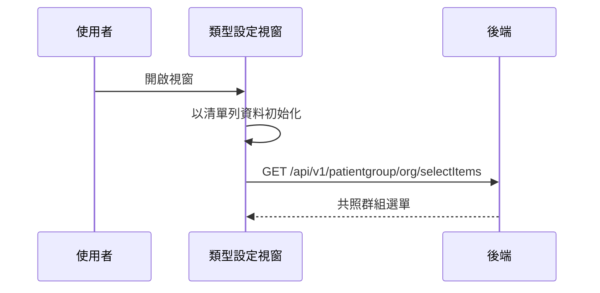

## 開啟表單類型設定視窗（載入共照群組選單）

**觸發**：表單管理頁開啟「表單類型設定」視窗
`src/views/Form/Management/components/UpdateFormTypeModal.vue:121`

### 步驟

1. **從清單列資料初始化視窗表單** `src/views/Form/Management/components/UpdateFormTypeModal.vue:52-67`
   純前端：把該表單目前的類型、是否啟用共照群組篩選、已選群組帶進視窗狀態，
   不打後端。

2. **載入該機構的共照群組選單** `src/views/Form/Management/components/UpdateFormTypeModal.vue:71-81`
   帶 `orgId` → `GET /api/v1/patientgroup/org/selectItems`（讀取）
   `src/views/Form/Management/components/UpdateFormTypeModal.vue:75`，
   回傳整理成下拉選項。**沒有 `orgId` 就直接略過**，選單留空。
   期間以視窗自己的載入鍵掛上載入狀態。

### 序列圖

### 資料變化

| 對象 | 動作 | 位置 |
|---|---|---|
| `GET /api/v1/patientgroup/org/selectItems` | 唯讀，取得共照群組選單 | `src/views/Form/Management/components/UpdateFormTypeModal.vue:75` |
| 載入 Store | 掛上與解除（`finally`，成功失敗都解除） | `src/views/Form/Management/components/UpdateFormTypeModal.vue:74` |

### 異常與補償

- 查詢沒有 try／catch，失敗由全域 API 回應攔截器統一顯示錯誤（見全域前置）。
- 載入狀態放在 `finally` 解除，成功失敗都會解除
  `src/views/Form/Management/components/UpdateFormTypeModal.vue:82`。

### 全域前置

授權標頭注入與錯誤顯示見〈每個請求送出前〉與〈API 錯誤的全域處理〉。
