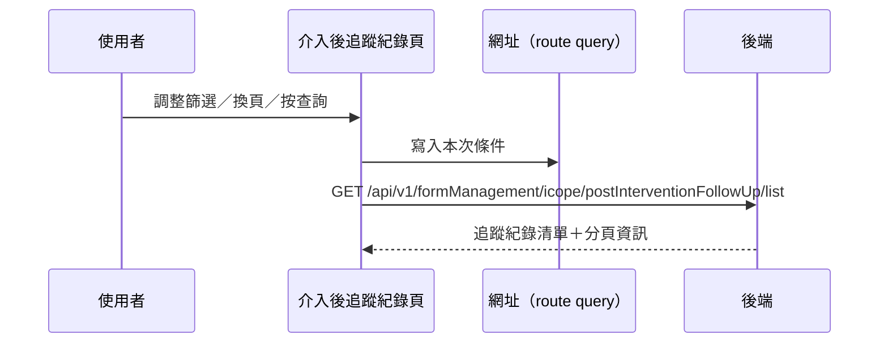

---
covers:
  - src/views/Form/_FormGid/ICopePostInterventionFollowUpRecord/IndexView.vue:218:UtilFormSelect:change
  - src/views/Form/_FormGid/ICopePostInterventionFollowUpRecord/IndexView.vue:222:UtilDatepicker:change
  - src/views/Form/_FormGid/ICopePostInterventionFollowUpRecord/IndexView.vue:228:UtilFormSelect:change
  - src/views/Form/_FormGid/ICopePostInterventionFollowUpRecord/IndexView.vue:236:UtilFormInput:clear
  - src/views/Form/_FormGid/ICopePostInterventionFollowUpRecord/IndexView.vue:237:UtilFormInput:keyup
  - src/views/Form/_FormGid/ICopePostInterventionFollowUpRecord/IndexView.vue:252:UtilTable:change-limit
  - src/views/Form/_FormGid/ICopePostInterventionFollowUpRecord/IndexView.vue:253:UtilTable:change-page
---

## 查詢 iCope 介入後追蹤紀錄

**觸發**：iCope 介入後追蹤紀錄頁上**八個**控件都走這條路徑，
與〈查詢 iCope 評估紀錄〉完全同構，只是端點不同：

| 控件 | 位置 |
|---|---|
| 查詢鈕 | `src/views/Form/_FormGid/ICopePostInterventionFollowUpRecord/IndexView.vue:240` |
| 類別下拉 | `src/views/Form/_FormGid/ICopePostInterventionFollowUpRecord/IndexView.vue:218` |
| 日期區間 | `src/views/Form/_FormGid/ICopePostInterventionFollowUpRecord/IndexView.vue:222` |
| 狀態下拉 | `src/views/Form/_FormGid/ICopePostInterventionFollowUpRecord/IndexView.vue:228` |
| 關鍵字清空 | `src/views/Form/_FormGid/ICopePostInterventionFollowUpRecord/IndexView.vue:236` |
| 關鍵字輸入按 Enter | `src/views/Form/_FormGid/ICopePostInterventionFollowUpRecord/IndexView.vue:237` |
| 變更每頁筆數 | `src/views/Form/_FormGid/ICopePostInterventionFollowUpRecord/IndexView.vue:252` |
| 換頁 | `src/views/Form/_FormGid/ICopePostInterventionFollowUpRecord/IndexView.vue:253` |

### 步驟

1. **決定頁碼、同步條件到網址**
   `src/views/Form/_FormGid/ICopePostInterventionFollowUpRecord/IndexView.vue:111-114`
   換頁帶頁碼進來會先從網址讀回條件；其餘控件把頁碼重設回第 1 頁。
   條件寫回網址 query `src/utils/composables/useQueryData.ts:145`。

2. **捲回頂端、帶條件查詢**
   `src/views/Form/_FormGid/ICopePostInterventionFollowUpRecord/IndexView.vue:115-128`
   帶表單 `formGid`、類別、日期區間、狀態、關鍵字與分頁
   → `GET /api/v1/formManagement/icope/postInterventionFollowUp/list`（讀取）
   `src/api/form.ts:631`。期間掛上載入狀態。

### 序列圖

### 資料變化

| 對象 | 動作 | 位置 |
|---|---|---|
| `GET /api/v1/formManagement/icope/postInterventionFollowUp/list` | 唯讀 | `src/api/form.ts:631` |
| 網址 query | 寫入查詢條件 | `src/utils/composables/useQueryData.ts:145` |
| 載入 Store | 掛上與解除 | `src/views/Form/_FormGid/ICopePostInterventionFollowUpRecord/IndexView.vue:111` |

### 異常與補償

- 查詢沒有 try／catch，失敗由全域 API 回應攔截器統一顯示錯誤（見全域前置）；
  「解除載入狀態」在 `await` 之後，失敗時依賴攔截器安全網。清單維持前一次內容。

### 全域前置

授權標頭注入與錯誤顯示見〈每個請求送出前〉與〈API 錯誤的全域處理〉。
