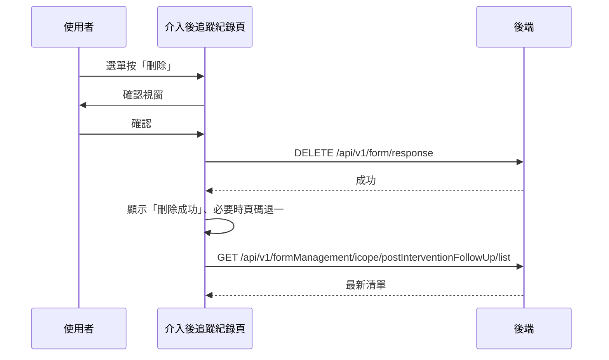

## 刪除 iCope 介入後追蹤紀錄

**觸發**：iCope 介入後追蹤紀錄清單某筆紀錄的下拉選單按「刪除」
`src/views/Form/_FormGid/ICopePostInterventionFollowUpRecord/IndexView.vue:332`

與〈刪除 iCope 評估紀錄〉完全同構：共用 confirm 視窗、同一支刪除 API，
只是重查回到追蹤清單的端點。

### 步驟

1. **先跳確認視窗**
   `src/views/Form/_FormGid/ICopePostInterventionFollowUpRecord/IndexView.vue:184-191`
   共用 `showConfirmModal`（`src/utils/composables/useModal.ts:59-61`）；
   按取消就中止，不打後端。

2. **送出刪除**
   `src/views/Form/_FormGid/ICopePostInterventionFollowUpRecord/IndexView.vue:193-195`
   帶 `responseId` → `DELETE /api/v1/form/response`（**寫入**） `src/api/form.ts:358`。
   期間掛上載入狀態。

3. **成功後提示並重查**
   `src/views/Form/_FormGid/ICopePostInterventionFollowUpRecord/IndexView.vue:196-201`
   顯示「刪除成功」，經 `updateList`（`src/utils/functions/execute.ts:16-22`）重算頁碼
   （最後一頁只剩一筆時退到前一頁），走〈查詢 iCope 介入後追蹤紀錄〉重查
   `GET /api/v1/formManagement/icope/postInterventionFollowUp/list` `src/api/form.ts:631`。

### 序列圖

### 資料變化

| 對象 | 動作 | 位置 |
|---|---|---|
| `DELETE /api/v1/form/response` | **寫入**，刪除追蹤紀錄 | `src/api/form.ts:358` |
| `GET /api/v1/formManagement/icope/postInterventionFollowUp/list` | 唯讀，刪除後重查 | `src/api/form.ts:631` |
| 提示 Store | 顯示成功訊息 | `src/views/Form/_FormGid/ICopePostInterventionFollowUpRecord/IndexView.vue:196` |
| 載入 Store | 掛上與解除 | `src/views/Form/_FormGid/ICopePostInterventionFollowUpRecord/IndexView.vue:193` |

### 異常與補償

- 刪除 API 沒有 try／catch，失敗由全域 API 回應攔截器統一顯示錯誤（見全域前置）；
  失敗時不提示、不重查，清單維持原狀與後端一致，可直接重試。
  「解除載入狀態」在 `await` 之後，失敗時依賴攔截器安全網。

### 全域前置

授權標頭注入與錯誤顯示見〈每個請求送出前〉與〈API 錯誤的全域處理〉。
