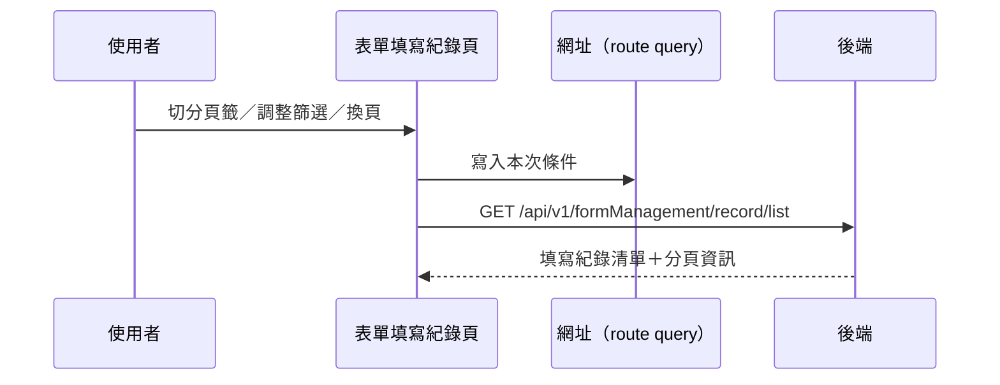

---
covers:
  - src/views/Form/_FormGid/Record/IndexView.vue:366:UtilTabs:change
  - src/views/Form/_FormGid/Record/IndexView.vue:379:UtilSearchSelect:change
  - src/views/Form/_FormGid/Record/IndexView.vue:383:UtilDatepicker:change
  - src/views/Form/_FormGid/Record/IndexView.vue:390:UtilFormInput:clear
  - src/views/Form/_FormGid/Record/IndexView.vue:391:UtilFormInput:keyup
  - src/views/Form/_FormGid/Record/IndexView.vue:425:UtilTable:change-limit
  - src/views/Form/_FormGid/Record/IndexView.vue:426:UtilTable:change-page
---

## 查詢表單填寫紀錄

**觸發**：機構端「表單填寫紀錄」頁上**八個**控件都走這條路徑：

| 控件 | 位置 |
|---|---|
| 查詢鈕 | `src/views/Form/_FormGid/Record/IndexView.vue:394` |
| 狀態分頁籤 | `src/views/Form/_FormGid/Record/IndexView.vue:366` |
| 共照群組下拉 | `src/views/Form/_FormGid/Record/IndexView.vue:379` |
| 日期區間 | `src/views/Form/_FormGid/Record/IndexView.vue:383` |
| 關鍵字清空 | `src/views/Form/_FormGid/Record/IndexView.vue:390` |
| 關鍵字輸入按 Enter | `src/views/Form/_FormGid/Record/IndexView.vue:391` |
| 變更每頁筆數 | `src/views/Form/_FormGid/Record/IndexView.vue:425` |
| 換頁 | `src/views/Form/_FormGid/Record/IndexView.vue:426` |

分頁籤是把「填寫狀態」當篩選條件寫進查詢
`src/views/Form/_FormGid/Record/IndexView.vue:119-124`，其餘與一般篩選相同。

### 步驟

1. **決定頁碼、把查詢條件同步到網址** `src/views/Form/_FormGid/Record/IndexView.vue:177-180`
   換頁帶頁碼進來會先從網址讀回既有條件；其餘控件把頁碼重設回第 1 頁。
   條件寫回網址 query `src/utils/composables/useQueryData.ts:145`（可分享、可重整）。

2. **捲回頂端、帶條件查詢** `src/views/Form/_FormGid/Record/IndexView.vue:181-194`
   帶表單 `formGid`、關鍵字、狀態、共照群組、日期區間與分頁
   → `GET /api/v1/formManagement/record/list`（讀取，API 層 try 只原樣拋回）
   `src/api/form.ts:140`。期間掛上載入狀態。

### 序列圖

### 資料變化

| 對象 | 動作 | 位置 |
|---|---|---|
| `GET /api/v1/formManagement/record/list` | 唯讀 | `src/api/form.ts:140` |
| 網址 query | 寫入查詢條件 | `src/utils/composables/useQueryData.ts:145` |
| 載入 Store | 掛上與解除 | `src/views/Form/_FormGid/Record/IndexView.vue:177` |

### 異常與補償

- 查詢失敗由全域 API 回應攔截器統一顯示錯誤（見全域前置）；
  「解除載入狀態」在 `await` 之後，失敗時依賴攔截器安全網。清單維持前一次內容。

### 全域前置

授權標頭注入與錯誤顯示見〈每個請求送出前〉與〈API 錯誤的全域處理〉。
