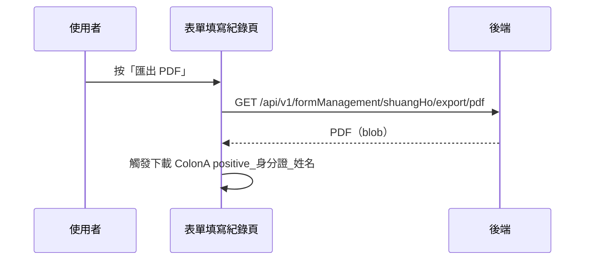

## 匯出單筆陽性個案報告 PDF（雙和）

**觸發**：表單填寫紀錄清單某筆紀錄的「匯出 PDF」鈕
`src/views/Form/_FormGid/Record/IndexView.vue:496`

雙和醫院客製功能：針對單筆填答（陽性個案）產出 PDF 報告下載。

### 步驟

1. **帶該筆與目前篩選條件向後端要 PDF** `src/views/Form/_FormGid/Record/IndexView.vue:309-321`
   帶 `responseId`、`formGid` 與目前的關鍵字、日期區間、共照群組
   → `GET /api/v1/formManagement/shuangHo/export/pdf`（讀取，回傳 blob）
   `src/api/care/report.ts:23`。期間掛上載入狀態。

2. **觸發瀏覽器下載** `src/views/Form/_FormGid/Record/IndexView.vue:322`
   檔名組成 `ColonA positive_<身分證號>_<姓名>`，交給 `downloadFile` 存檔。

### 序列圖

### 資料變化

| 對象 | 動作 | 位置 |
|---|---|---|
| `GET /api/v1/formManagement/shuangHo/export/pdf` | 唯讀，產出 PDF | `src/api/care/report.ts:23` |
| 瀏覽器下載 | 存檔 | `src/views/Form/_FormGid/Record/IndexView.vue:322` |
| 載入 Store | 掛上與解除 | `src/views/Form/_FormGid/Record/IndexView.vue:310` |

### 異常與補償

- 匯出沒有 try／catch，失敗由全域 API 回應攔截器統一顯示錯誤（見全域前置）；
  失敗時不觸發下載，「解除載入狀態」在 `await` 之後，依賴攔截器安全網。

### 全域前置

授權標頭注入與錯誤顯示見〈每個請求送出前〉與〈API 錯誤的全域處理〉。
