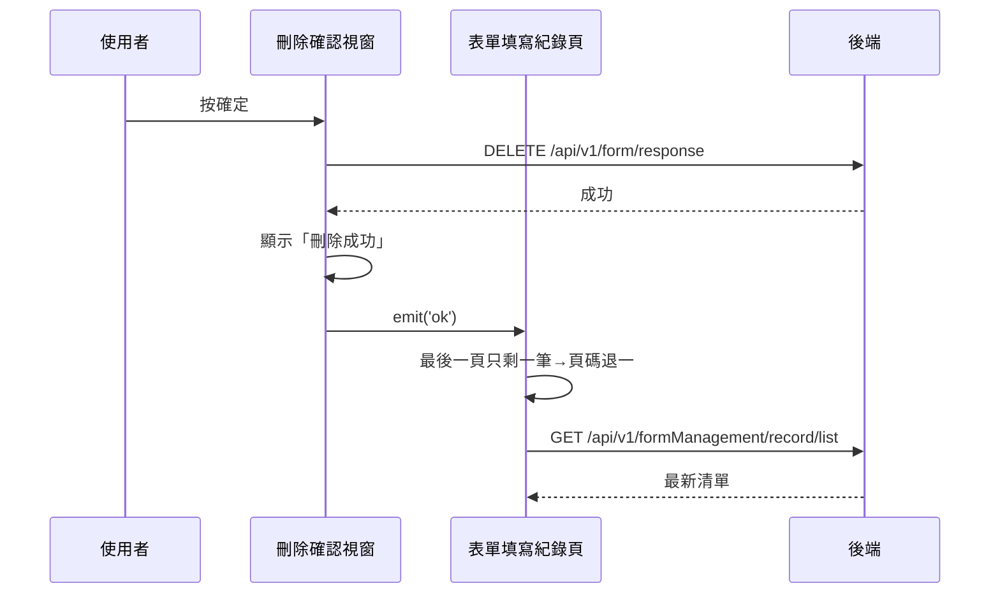

## 刪除表單填寫紀錄

**觸發**：表單填寫紀錄頁的「刪除紀錄」確認視窗按確定
`src/views/Form/_FormGid/Record/components/DeleteFormRecordModal.vue:55`

### 步驟

1. **送出刪除** `src/views/Form/_FormGid/Record/components/DeleteFormRecordModal.vue:41-46`
   沒有 `responseId` 直接略過。帶該筆填答的 `responseId`
   → `DELETE /api/v1/form/response`（**寫入**） `src/api/form.ts:358`。
   期間掛上載入狀態。

2. **成功後提示、通知父層** `src/views/Form/_FormGid/Record/components/DeleteFormRecordModal.vue:47-48`
   顯示「刪除成功」，`emit('ok')` → 父層以刪除模式重算頁碼並重查
   `src/views/Form/_FormGid/Record/IndexView.vue:545`：
   `updateList({ isDelete: true, … })`，**最後一頁只剩一筆時自動退到前一頁**，
   再走〈查詢表單填寫紀錄〉重查 `GET /api/v1/formManagement/record/list`。

### 序列圖

### 資料變化

| 對象 | 動作 | 位置 |
|---|---|---|
| `DELETE /api/v1/form/response` | **寫入**，刪除填寫紀錄 | `src/api/form.ts:358` |
| `GET /api/v1/formManagement/record/list` | 唯讀，刪除後重查 | `src/api/form.ts:140` |
| 提示 Store | 顯示成功訊息 | `src/views/Form/_FormGid/Record/components/DeleteFormRecordModal.vue:47` |
| 載入 Store | 掛上與解除 | `src/views/Form/_FormGid/Record/components/DeleteFormRecordModal.vue:44` |

### 異常與補償

- 刪除 API 沒有 try／catch，失敗由全域 API 回應攔截器統一顯示錯誤（見全域前置）；
  失敗時不提示、不發事件、不重查，清單維持原狀與後端一致，可直接重試。
  「解除載入狀態」在 `await` 之後，失敗時依賴攔截器安全網。

### 未追蹤的部分

- 父層 `emit('ok')` 的 handler 是行內表達式，封包標「解析不到，未展開」；
  上面重查路徑是依該行內容（`updateList({ isDelete: true, pageInfo, callback: getFormRecordHandler })`
  `src/views/Form/_FormGid/Record/IndexView.vue:545`）描述，其展開未逐層追蹤。

### 全域前置

授權標頭注入與錯誤顯示見〈每個請求送出前〉與〈API 錯誤的全域處理〉。
