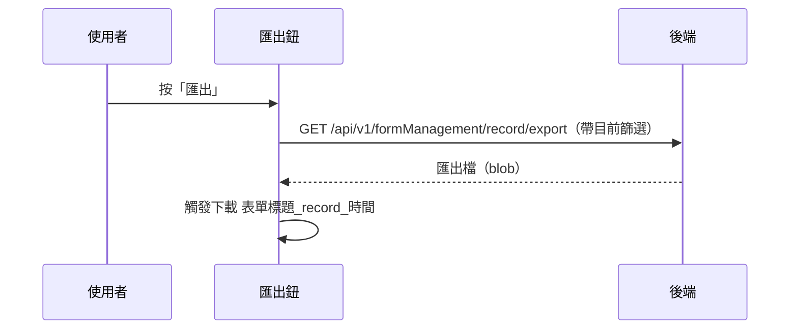

## 匯出表單填寫紀錄

**觸發**：表單填寫紀錄頁的「匯出」鈕
`src/views/Form/_FormGid/Record/components/ExportButtonGroup.vue:53`

### 步驟

1. **帶目前篩選條件向後端要匯出檔** `src/views/Form/_FormGid/Record/components/ExportButtonGroup.vue:33-41`
   帶表單 `formGid` 與清單頁目前的關鍵字、共照群組、日期區間
   → `GET /api/v1/formManagement/record/export`（讀取，回傳 blob） `src/api/form.ts:175`。
   期間掛上載入狀態。匯出的範圍**跟著畫面上的篩選走**，不是全量。

2. **觸發瀏覽器下載** `src/views/Form/_FormGid/Record/components/ExportButtonGroup.vue:42-46`
   檔名組成 `<表單標題>_record_<當下時間>`。

### 序列圖

### 資料變化

| 對象 | 動作 | 位置 |
|---|---|---|
| `GET /api/v1/formManagement/record/export` | 唯讀，產出匯出檔 | `src/api/form.ts:175` |
| 瀏覽器下載 | 存檔 | `src/views/Form/_FormGid/Record/components/ExportButtonGroup.vue:46` |
| 載入 Store | 掛上與解除 | `src/views/Form/_FormGid/Record/components/ExportButtonGroup.vue:34` |

### 異常與補償

- 匯出沒有 try／catch，失敗由全域 API 回應攔截器統一顯示錯誤（見全域前置）；
  失敗時不觸發下載，「解除載入狀態」在 `await` 之後，依賴攔截器安全網。

### 全域前置

授權標頭注入與錯誤顯示見〈每個請求送出前〉與〈API 錯誤的全域處理〉。
