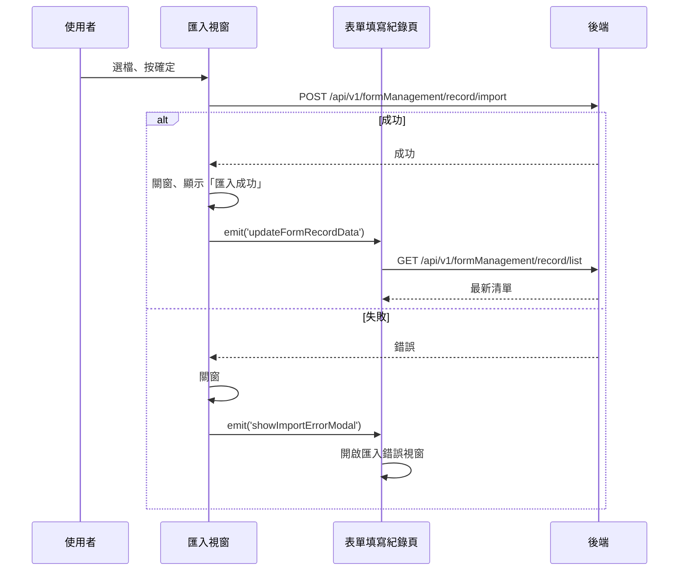

## 匯入表單填寫紀錄

**觸發**：「匯入表單」視窗選好檔案後按確定
`src/views/Form/_FormGid/Record/components/ImportFormModal.vue:113`

這是本域少數**成功與失敗都有明確 UI 分支**的寫入流程。

### 步驟

1. **上傳匯入檔** `src/views/Form/_FormGid/Record/components/ImportFormModal.vue:90-92`
   表單資料轉成 FormData
   → `POST /api/v1/formManagement/record/import`（**寫入**） `src/api/form.ts:170`。
   期間掛上載入狀態。

2. **成功：關窗、提示、通知父層重查** `src/views/Form/_FormGid/Record/components/ImportFormModal.vue:93-96`
   顯示「匯入成功」，`emit('updateFormRecordData')` → 父層
   `src/views/Form/_FormGid/Record/IndexView.vue:539` 重查清單（回第 1 頁），
   走〈查詢表單填寫紀錄〉→ `GET /api/v1/formManagement/record/list` `src/api/form.ts:140`。

3. **失敗：關窗、開啟匯入錯誤視窗** `src/views/Form/_FormGid/Record/components/ImportFormModal.vue:98-100`
   `catch` 接住錯誤，`emit('showImportErrorModal')` → 父層
   `src/views/Form/_FormGid/Record/IndexView.vue:280-282` 打開錯誤說明視窗。
   不重查清單。

### 序列圖

### 資料變化

| 對象 | 動作 | 位置 |
|---|---|---|
| `POST /api/v1/formManagement/record/import` | **寫入**，批次匯入填寫紀錄 | `src/api/form.ts:170` |
| `GET /api/v1/formManagement/record/list` | 唯讀，成功後重查（回第 1 頁） | `src/api/form.ts:140` |
| 提示 Store | 成功訊息 | `src/views/Form/_FormGid/Record/components/ImportFormModal.vue:95` |
| 載入 Store | 掛上與解除 | `src/views/Form/_FormGid/Record/components/ImportFormModal.vue:91` |

### 異常與補償

- 匯入失敗有專屬補償：`catch` 關窗並開啟**匯入錯誤視窗**，
  不會只依賴全域攔截器的錯誤提示（攔截器的訊息仍會出現）。
- 因為錯誤被 catch 接住，「解除載入狀態」成功失敗都會執行
  `src/views/Form/_FormGid/Record/components/ImportFormModal.vue:102`。

### 全域前置

授權標頭注入與錯誤顯示見〈每個請求送出前〉與〈API 錯誤的全域處理〉。
