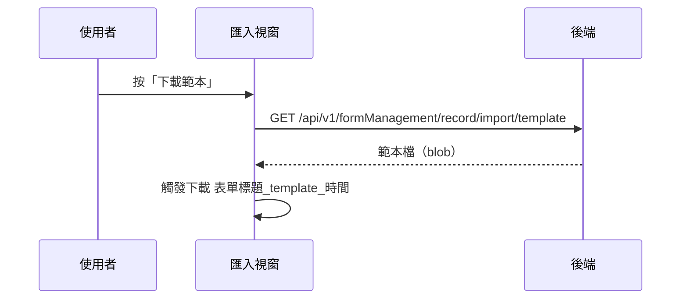

## 下載匯入範本

**觸發**：「匯入表單」視窗按「下載範本」
`src/views/Form/_FormGid/Record/components/ImportFormModal.vue:119`

匯入前的配套動作：先拿到這張表單專屬的範本檔，照格式填好再匯入。

### 步驟

1. **帶表單 ID 向後端要範本** `src/views/Form/_FormGid/Record/components/ImportFormModal.vue:77-80`
   → `GET /api/v1/formManagement/record/import/template`（讀取，回傳 blob）
   `src/api/form.ts:162`。期間以視窗自己的載入鍵掛上載入狀態。

2. **觸發瀏覽器下載** `src/views/Form/_FormGid/Record/components/ImportFormModal.vue:81-85`
   檔名組成 `<表單標題>_template_<當下時間>`。

### 序列圖

### 資料變化

| 對象 | 動作 | 位置 |
|---|---|---|
| `GET /api/v1/formManagement/record/import/template` | 唯讀，產出範本 | `src/api/form.ts:162` |
| 瀏覽器下載 | 存檔 | `src/views/Form/_FormGid/Record/components/ImportFormModal.vue:84` |
| 載入 Store | 掛上與解除 | `src/views/Form/_FormGid/Record/components/ImportFormModal.vue:78` |

### 異常與補償

- 沒有 try／catch，失敗由全域 API 回應攔截器統一顯示錯誤（見全域前置）；
  失敗時不觸發下載，「解除載入狀態」在 `await` 之後，依賴攔截器安全網。

### 全域前置

授權標頭注入與錯誤顯示見〈每個請求送出前〉與〈API 錯誤的全域處理〉。
