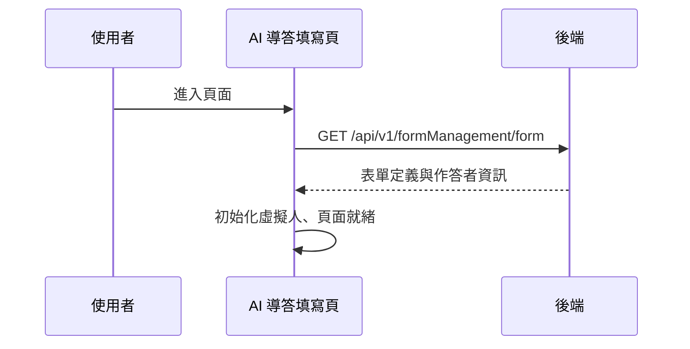

## 進入 AI 導答填寫模式（載入表單與虛擬人）

**觸發**：AI 導答填寫頁載入
`src/views/Form/_FormGid/Response/CreateAiGuideMode.vue:255`

### 步驟

1. **取得表單定義** `src/views/Form/_FormGid/Response/CreateAiGuideMode.vue:54-61`
   帶 `formGid`、推薦碼與是否公開，經共用的
   `getFormInfoHandler` `src/components/Form/ElasticForm/functions/eformsFunction.ts:166-187`
   → `GET /api/v1/formManagement/form`（讀取） `src/api/form.ts:84`，
   整理受測者、推薦人、機構等顯示欄位。期間掛上載入狀態，`finally` 解除。
   公開表單會改走 `getFormPublic`（同函式內依 `isPublic` 切換），該分支封包未展開。

2. **初始化 Live2D 虛擬人後開放互動** `src/views/Form/_FormGid/Response/CreateAiGuideMode.vue:236-240`
   `initLive2DHandler` 屬前端資源載入，封包未展開；完成後標記頁面就緒。

### 序列圖

### 資料變化

| 對象 | 動作 | 位置 |
|---|---|---|
| `GET /api/v1/formManagement/form` | 唯讀 | `src/api/form.ts:84` |
| 載入 Store | 掛上與解除（`finally`） | `src/views/Form/_FormGid/Response/CreateAiGuideMode.vue:55` |

### 異常與補償

- 查詢沒有 catch，失敗由全域 API 回應攔截器顯示錯誤（見全域前置）；
  載入狀態在 `finally` 解除。失敗時 `init` 中斷，頁面不會標記就緒。

### 未追蹤的部分

- 公開表單分支（`getFormPublic`）與 Live2D 初始化未展開。

### 全域前置

授權標頭注入與錯誤顯示見〈每個請求送出前〉與〈API 錯誤的全域處理〉。
