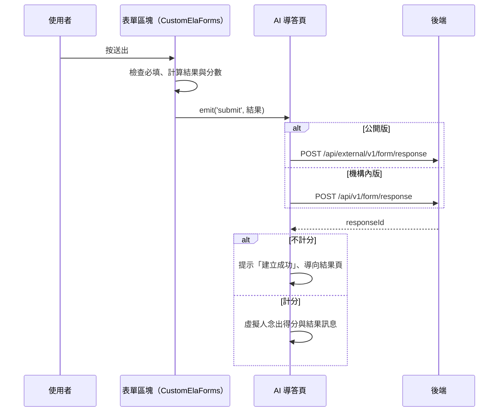

## 送出 AI 導答表單填答

**觸發**：AI 導答填寫模式的表單區塊按「送出」
`src/views/Form/_FormGid/Response/components/CustomElaForms.vue:210`

### 步驟

1. **檢查目前區塊的必填** `src/views/Form/_FormGid/Response/components/CustomElaForms.vue:126-139`
   有必填未答就跳「必答題」提示視窗並中止，不打後端。

2. **算出填答結果與分數訊息，往上發** `src/views/Form/_FormGid/Response/components/CustomElaForms.vue:142-147`
   `emit('submit')` → AI 導答頁的 `submitHandler`
   `src/views/Form/_FormGid/Response/CreateAiGuideMode.vue:289`，先停掉虛擬人語音。

3. **依版本建立填答（狀態「已完成」）** `src/views/Form/_FormGid/Response/CreateAiGuideMode.vue:143-145`
   - **公開版** → `POST /api/external/v1/form/response`（**寫入**）
     `src/api/publicForm.ts:12`，成功後回傳「導向公開結果頁
     （FormResponsePublicDetail）」的動作 `src/views/Form/_FormGid/Response/CreateAiGuideMode.vue:178-183`。
   - **機構內版** → `POST /api/v1/form/response`（**寫入**） `src/api/form.ts:318`，
     成功後回傳「導向結果頁（FormResponseDetail）」的動作
     `src/views/Form/_FormGid/Response/CreateAiGuideMode.vue:204-209`。

   期間掛上載入狀態，`finally` 解除。

4. **依是否計分決定收尾** `src/views/Form/_FormGid/Response/CreateAiGuideMode.vue:146-153`
   - **不計分**：提示「建立成功」，立即執行導頁動作前往結果頁。
   - **計分**：不導頁——組出「您的填答結果／得分」訊息，讓虛擬人念出
     `src/views/Form/_FormGid/Response/CreateAiGuideMode.vue:197-206`
     （中文用文字對話，其他語言播語音檔並對嘴），
     導頁動作存起來留給「查看填答紀錄」按鈕。

### 序列圖

### 資料變化

| 對象 | 動作 | 位置 |
|---|---|---|
| `POST /api/external/v1/form/response` | **寫入**，公開版建立填答 | `src/api/publicForm.ts:12` |
| `POST /api/v1/form/response` | **寫入**，機構內版建立填答 | `src/api/form.ts:318` |
| 導頁 | 結果頁（立即或由使用者按鈕觸發） | `src/views/Form/_FormGid/Response/CreateAiGuideMode.vue:204-209` |
| 提示 Store | 不計分時的成功訊息 | `src/views/Form/_FormGid/Response/CreateAiGuideMode.vue:148` |
| 載入 Store | 掛上與解除（`finally`） | `src/views/Form/_FormGid/Response/CreateAiGuideMode.vue:163` |

### 異常與補償

- 兩條寫入都有 `catch`，失敗時把結果化為 `false`
  `src/views/Form/_FormGid/Response/CreateAiGuideMode.vue:211`，
  上層看到失敗就**直接中止**（不提示成功、不導頁、不念結果）
  `src/views/Form/_FormGid/Response/CreateAiGuideMode.vue:145`；
  全域攔截器的錯誤提示仍會出現（見全域前置）。填答內容留在畫面上，可重試。

### 全域前置

授權標頭注入與錯誤顯示見〈每個請求送出前〉與〈API 錯誤的全域處理〉。
