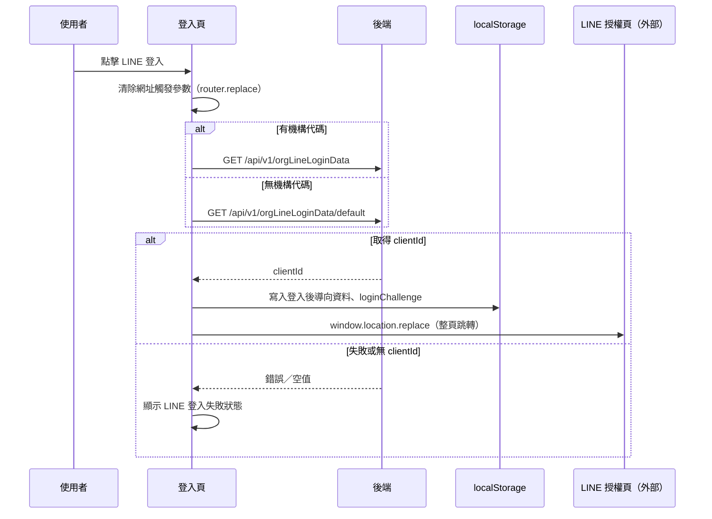

## LINE 登入：導向 LINE 授權頁

**觸發**：登入頁按下 LINE 登入按鈕
`src/views/Login/Index/IndexView.vue:381`

### 步驟

1. **清掉網址上的觸發參數** `src/views/Login/Index/IndexView.vue:163-181`
   用 `router.replace` 把 query 裡的 `clickLineLoginButton` 移除（封包標為動態導頁目標
   `src/views/Login/Index/IndexView.vue:166`），避免殘留在網址上。

2. **取得該機構的 LINE 登入設定（clientId）**
   有 `orgCode` 時呼叫 `GET /api/v1/orgLineLoginData`（讀取）
   `src/views/Login/Index/IndexView.vue:172`；沒有 `orgCode` 則改走
   `GET /api/v1/orgLineLoginData/default`（讀取）
   `src/views/Login/Index/IndexView.vue:185`。兩條路徑各自掛上／解除載入狀態。

3. **檢查 clientId** `src/views/Login/Index/IndexView.vue:163-181`
   回應裡拿不到 `clientId`，或 API 失敗，就設定失敗旗標
   `isLineLoginHandlerFailed`（機構版延遲 1 秒才設定），頁面顯示 LINE 登入失敗狀態，
   流程到此為止。

4. **暫存登入完成後要回去的頁面** `src/views/Login/Index/IndexView.vue:196-244`
   把 `redirect` 參數轉成路由物件存進 localStorage
   `src/utils/composables/useLocalStorage.ts:9`（**寫入**）。注意：導向外部網址的功能
   已被註解關閉（MARKET 註記）——就算 `redirect` 是完整網址，也一律改存預設頁。
   `loginChallenge` 也在此時存進另一個 localStorage key。

5. **整頁跳轉到 LINE 授權頁** `src/views/Login/Index/IndexView.vue:196-244`
   組出 LINE OAuth `/authorize` 網址（`redirect_uri` 指回本站 Login 路由，
   帶 `lineLogin=true`、機構代碼與 `clientId`），用 `window.location.replace` 離開本站。

### 序列圖

### 資料變化

| 對象 | 動作 | 位置 |
|---|---|---|
| localStorage（導向資料） | **寫入**登入後要回去的路由物件 | `src/utils/composables/useLocalStorage.ts:9` |
| localStorage（loginChallenge） | **寫入**暫存的 loginChallenge | `src/utils/composables/useLocalStorage.ts:9` |
| `GET /api/v1/orgLineLoginData`（`/default`） | 唯讀，取得機構 LINE 登入資料 | `src/views/Login/Index/IndexView.vue:172`、`:185` |
| 載入 Store | 掛上後於 finally 解除 | `src/views/Login/Index/IndexView.vue:171`、`:180` |
| 瀏覽器網址 | 整頁跳轉到 LINE 授權頁 | `src/views/Login/Index/IndexView.vue:196-244` |

### 異常與補償

- **兩支查詢 API 都有 `.catch`**：失敗只會設定 `isLineLoginHandlerFailed` 旗標讓頁面
  顯示失敗狀態，本流程自行收掉錯誤，不靠攔截器決定畫面。
- **載入狀態在 `.finally()` 解除**，成功失敗都會執行
  `src/views/Login/Index/IndexView.vue:180`、`:193`。
- 跳轉發生在寫入 localStorage 之後，順序保證回站時導向資料已就緒。

### 未追蹤的部分

- `src/views/Login/Index/IndexView.vue:166` 的導頁封包標為**動態目標**
  （`router.replace` 只是替換 query）。
- 跳轉到 LINE 之後的授權流程屬外部服務，不在封包內；`redirect_uri` 指回本站
  Login 路由並帶 `lineLogin=true`，返回後的處理不在本封包內
  （全域前置篇章有 LineLogin 路由守衛）。

### 全域前置

API 呼叫會經過〈每個請求送出前〉注入授權與語言標頭。
