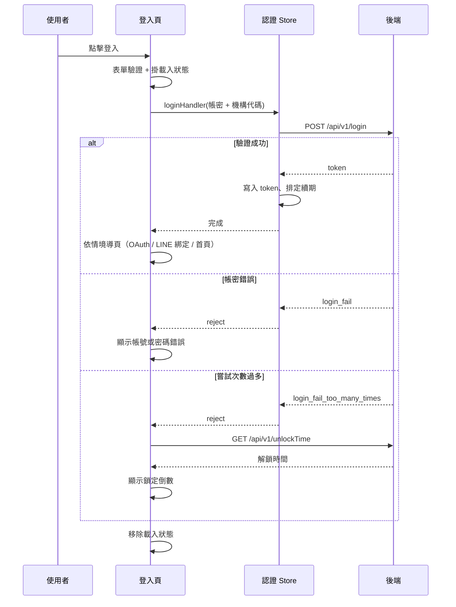

## 流程：使用者以帳號密碼登入

**觸發**：登入頁點擊「登入」按鈕 `src/views/Login/Index/IndexView.vue:502`

### 步驟

1. **表單驗證通過後才進入登入邏輯** `src/views/Login/Index/IndexView.vue:168-234`
   登入 handler 包在表單驗證器裡，欄位不合法時不會往下走。進入後立刻掛上全域載入
   狀態 `src/views/Login/Index/IndexView.vue:169`，直到整個流程結束才移除
   `src/views/Login/Index/IndexView.vue:233`。

2. **組出登入資料並交給認證 Store** `src/views/Login/Index/IndexView.vue:176`
   送出的是表單欄位加上「目前機構代碼」——同一組帳密在不同機構下是不同的登入情境，
   所以機構代碼是登入請求的一部分，不是附加參數。

3. **向後端驗證帳密** `src/api/login.ts:19`
   `POST /api/v1/login`。這是本流程唯一的寫入型後端互動。

4. **寫入 token 並排定續期** `src/stores/auth.ts:94-109`
   成功後把 token 存進認證 Store `src/stores/auth.ts:175-178`，並排定一個在 JWT 到期前
   觸發的續期計時器。使用者不會察覺這一步，但它決定了登入狀態能維持多久。

5. **判斷是否強制改密碼** `src/stores/auth.ts:99`
   若 JWT 帶有「需要變更密碼」的標記，開啟重設密碼視窗。此時登入其實已經成功。

6. **依情境決定登入後去哪** `src/views/Login/Index/IndexView.vue:168-234`
   三條互斥分支：
   - **OAuth 授權流程**：帶有 login challenge 時導向授權頁 `src/views/Login/Index/IndexView.vue:181`
   - **企業機構 LINE 綁定**：呼叫 `POST /api/v1/bindLineLogin` 建立帳號與 LINE 的綁定
     `src/views/Login/Index/IndexView.vue:184`，成功則轉往後端回傳的網址；失敗則導向
     手動綁定頁 `src/views/Login/Index/IndexView.vue:191`
   - **一般登入**：有指定 redirect 就解析成路由後導向，否則進預設首頁
     `src/views/Login/Index/IndexView.vue:213` `src/views/Login/Index/IndexView.vue:216`

### 序列圖

### 資料變化

| 對象 | 動作 | 位置 |
|---|---|---|
| `POST /api/v1/login` | 建立登入工作階段，取得 token | `src/api/login.ts:19` |
| `POST /api/v1/bindLineLogin` | 建立帳號與 LINE 的綁定（僅企業機構 LINE 登入分支） | `src/views/Login/Index/IndexView.vue:184` |
| 認證 Store 的 token | 寫入，並排定到期前續期 | `src/stores/auth.ts:175-178` |
| 版面 Store 的重設密碼視窗 | 依 JWT 標記開啟 | `src/stores/layout.ts:66-68` |
| `GET /api/v1/unlockTime` | 唯讀，僅帳號被鎖定時查詢 | `src/views/Login/Index/IndexView.vue:240` |

### 異常與補償

- **登入 API 本身在 try 保護內** `src/api/login.ts:19`。網路或伺服器錯誤不會讓頁面崩潰。
- **帳號或密碼錯誤**：後端回傳 `login_fail`，頁面顯示錯誤提示，使用者可直接重試。
  沒有任何狀態需要回復——token 尚未寫入。
- **嘗試次數過多**：後端回傳 `login_fail_too_many_times`，此時會額外查詢解鎖時間
  `src/views/Login/Index/IndexView.vue:238-247`，並啟動倒數
  `src/views/Login/Index/IndexView.vue:251-261`，倒數結束後解除鎖定提示
  `src/views/Login/Index/IndexView.vue:273-280`。
- **LINE 綁定失敗不阻斷登入**：綁定 API 失敗時導向手動綁定頁
  `src/views/Login/Index/IndexView.vue:191`，登入狀態已經成立、token 已寫入。
- **載入狀態一定會被移除** `src/views/Login/Index/IndexView.vue:233`，寫在 finally，
  不論成功或失敗都會執行。

### 未追蹤的部分

- 兩處導頁目標是執行期算出來的 `src/views/Login/Index/IndexView.vue:213`
  `src/views/Login/Index/IndexView.vue:216`，靜態分析無法決定實際去哪一頁。
- redirect 字串轉路由的轉換邏輯位於共用層 `src/views/Login/Index/IndexView.vue:215`，
  依設定未展開其內部實作。
