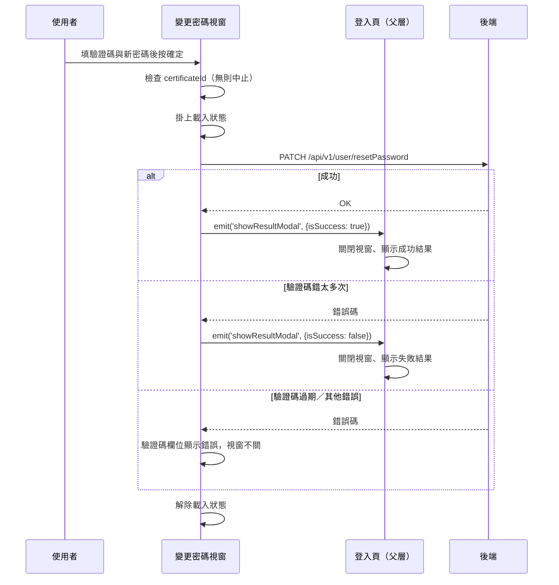

## 忘記密碼：驗證並設定新密碼

**觸發**：變更密碼視窗填好驗證碼與新密碼後按下確定
`src/views/Login/Index/components/ForgetPassword/ChangePasswordModal.vue:191`

接在〈忘記密碼：申請驗證碼〉之後——該流程取得的 `certificateId` 由父層傳進來，
是這次申請的識別。這個視窗同樣掛在一般登入頁與快速應變平台登入頁兩處。

### 步驟

1. **前置檢查** `src/views/Login/Index/components/ForgetPassword/ChangePasswordModal.vue:132-147`
   沒有 `certificateId` 就直接中止，什麼都不做（表示沒有走完上一步的申請）。

2. **送出重設密碼請求** `src/api/login.ts:154`
   掛上載入狀態後呼叫 `PATCH /api/v1/user/resetPassword`（**寫入**），
   帶 `certificateId`、使用者輸入的驗證碼與新密碼。

3. **成功：通知父層顯示結果** `src/views/Login/Index/components/ForgetPassword/ChangePasswordModal.vue:142`
   發出 `showResultModal`（`isSuccess: true`）。父層關閉變更密碼視窗、
   開啟結果視窗顯示成功。兩個候選父層 handler 內容相同：
   - 一般登入頁 `src/views/Login/Index/IndexView.vue:274-278`（掛載點 `:402`）
   - 快速應變平台登入頁 `src/views/RapidResponsePlatform/LoginView.vue:138-142`（掛載點 `:252`）

4. **失敗：依錯誤碼分流** `src/views/Login/Index/components/ForgetPassword/ChangePasswordModal.vue:149-160`
   - `input_wrong_verification_code_too_many_times`（錯太多次）→ 同樣發
     `showResultModal` 但 `isSuccess: false`，父層開啟結果視窗顯示失敗
     `src/views/Login/Index/components/ForgetPassword/ChangePasswordModal.vue:152`；
   - `mobile_verification_code_expired`（驗證碼過期）→ 驗證碼欄位顯示過期錯誤；
   - 其他錯誤碼 → 直接顯示在驗證碼欄位上。

5. **解除載入狀態** `src/views/Login/Index/components/ForgetPassword/ChangePasswordModal.vue:146`
   在流程尾執行；錯誤已被 `.catch` 接住，成功失敗都會走到。

### 序列圖

### 資料變化

| 對象 | 動作 | 位置 |
|---|---|---|
| `PATCH /api/v1/user/resetPassword` | **重設密碼**（憑 certificateId＋驗證碼） | `src/api/login.ts:154` |
| 父層頁面狀態 | 關閉變更密碼視窗、開啟結果視窗（成功或失敗） | `src/views/Login/Index/IndexView.vue:274-278` |
| 載入 Store | 掛上後於流程尾解除 | `src/views/Login/Index/components/ForgetPassword/ChangePasswordModal.vue:134`、`:146` |

### 異常與補償

- **有 `.catch`**，錯誤碼分三路（見步驟 4）：終結型錯誤（錯太多次）走結果視窗、
  可重試錯誤留在原視窗顯示欄位錯誤，使用者可改驗證碼重送。
- **載入狀態一定解除** `src/views/Login/Index/components/ForgetPassword/ChangePasswordModal.vue:146`。
- 前置檢查失敗（無 certificateId）不打 API、無任何提示。

### 未追蹤的部分

- **emit 有 2 個父層候選**（同一元件掛在兩個頁面），實際走向依當下頁面決定。
- 父層開啟的「結果視窗」元件本身不在此封包內。
- 封包在錯誤路徑的 emit 節點標了⟨父層 handler 解析不到，未展開⟩，但同名 handler
  的原始碼已在封包他處提供（即上列兩個 `showResultModalHandler`）。

### 全域前置

API 呼叫會經過〈每個請求送出前〉注入授權與語言標頭，失敗時由〈API 錯誤的全域處理〉接手。
