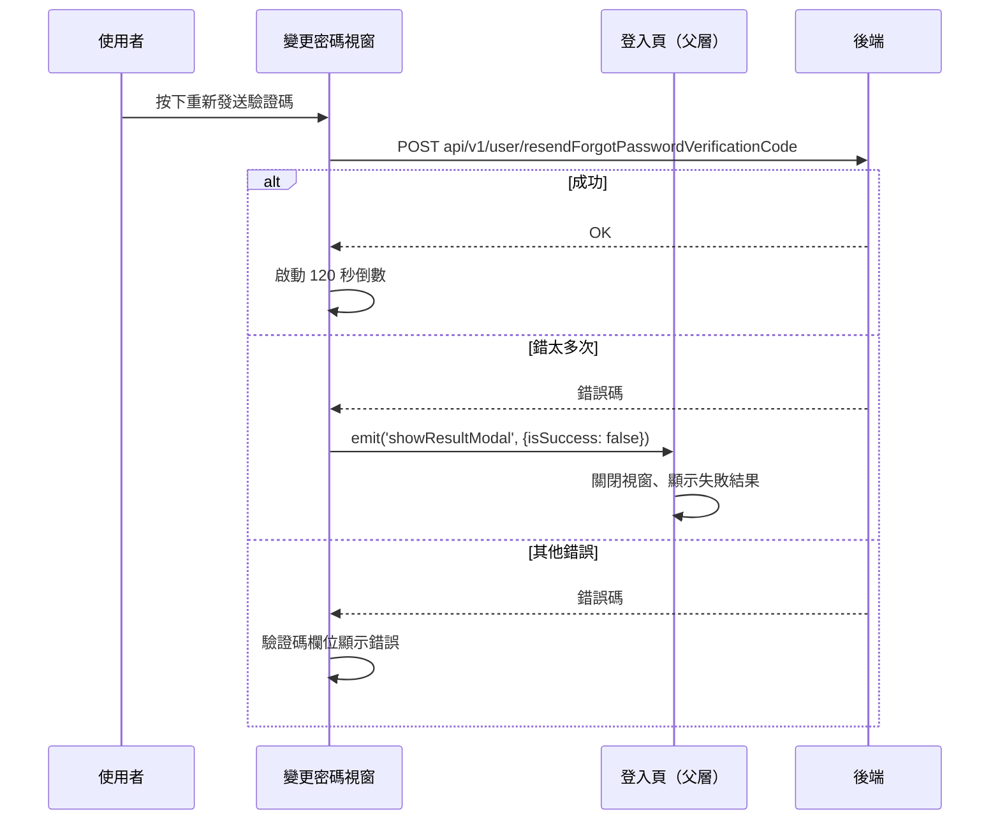

## 忘記密碼：重新發送驗證碼

**觸發**：變更密碼視窗按下重新發送驗證碼
`src/views/Login/Index/components/ForgetPassword/ChangePasswordModal.vue:206`

### 步驟

1. **重新發送驗證碼** `src/views/Login/Index/components/ForgetPassword/ChangePasswordModal.vue:162-168`
   呼叫 `POST api/v1/user/resendForgotPasswordVerificationCode`（**寫入**）
   `src/api/login.ts:150`，帶上一步申請時父層暫存的資料（含 certificateId）。
   這條流程沒有掛載入狀態。

2. **成功：啟動 120 秒倒數** `src/views/Login/Index/components/ForgetPassword/ChangePasswordModal.vue:173-182`
   `count` 從 120 每秒遞減到 0 後停止。

3. **失敗：依錯誤碼分流** `src/views/Login/Index/components/ForgetPassword/ChangePasswordModal.vue:149-160`
   與〈忘記密碼：驗證並設定新密碼〉共用同一個 `errorHandler`：
   - `input_wrong_verification_code_too_many_times` → 發 `showResultModal`
     （`isSuccess: false`），父層關閉視窗、顯示失敗結果
     `src/views/Login/Index/components/ForgetPassword/ChangePasswordModal.vue:152`；
   - 其他錯誤碼 → 顯示在驗證碼欄位上。

   兩個候選父層 handler 內容相同：一般登入頁
   `src/views/Login/Index/IndexView.vue:274-278`（掛載點 `:402`）、
   快速應變平台登入頁 `src/views/RapidResponsePlatform/LoginView.vue:138-142`
   （掛載點 `:252`）。

### 序列圖

### 資料變化

| 對象 | 動作 | 位置 |
|---|---|---|
| `POST api/v1/user/resendForgotPasswordVerificationCode` | **重新發送驗證碼** | `src/api/login.ts:150` |
| 元件狀態 | 倒數計時 `count` 從 120 遞減 | `src/views/Login/Index/components/ForgetPassword/ChangePasswordModal.vue:173-182` |

### 異常與補償

- **有 `.catch`**，錯誤處理同〈忘記密碼：驗證並設定新密碼〉的分流。
- **沒有載入狀態**——這條流程不掛 loading key，按鈕期間畫面沒有整頁載入效果。
- 失敗時不啟動倒數。

### 未追蹤的部分

- **emit 有 2 個父層候選**（同一元件掛在兩個頁面），實際走向依當下頁面決定。
- API 路徑照封包原樣為 `api/v1/...`（開頭無斜線），與域內其他端點寫法不同。

### 全域前置

API 呼叫會經過〈每個請求送出前〉注入授權與語言標頭，失敗時由〈API 錯誤的全域處理〉接手。
