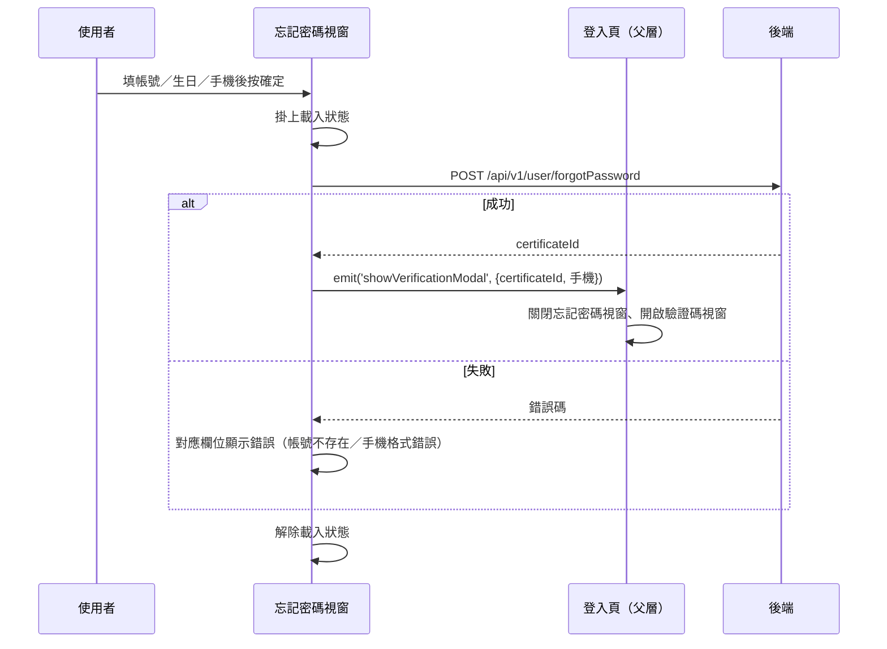

## 忘記密碼：申請驗證碼

**觸發**：忘記密碼視窗填好帳號、生日與手機號碼後按下確定
`src/views/Login/Index/components/ForgetPassword/ForgetPasswordModal.vue:119`

這個視窗同時掛在一般登入頁與快速應變平台登入頁，emit 由當下所在頁面的 handler 接手
（見「未追蹤的部分」下方的雙父層說明）。

### 步驟

1. **送出忘記密碼申請** `src/views/Login/Index/components/ForgetPassword/ForgetPasswordModal.vue:94-110`
   表單驗證通過後掛上載入狀態，呼叫 `POST /api/v1/user/forgotPassword`（**寫入**）
   `src/api/login.ts:144`，帶帳號（loginName）、生日（格式化為 YYYY-MM-DD）、
   國碼與手機號碼。

2. **成功：把驗證資訊往上交給父層** `src/views/Login/Index/components/ForgetPassword/ForgetPasswordModal.vue:98`
   發出 `showVerificationModal` 事件，帶回應中的 `certificateId` 與手機號碼——
   這是後續「設定新密碼」時識別這次申請的 join key。

3. **父層收到事件後切換視窗**
   關閉忘記密碼視窗、開啟驗證碼視窗。兩個候選父層的 handler 內容相同：
   - 一般登入頁 `src/views/Login/Index/IndexView.vue:263-267`（掛載點 `:391`）
   - 快速應變平台登入頁 `src/views/RapidResponsePlatform/LoginView.vue:127-131`（掛載點 `:241`）

4. **失敗：把已知錯誤轉成欄位錯誤** `src/views/Login/Index/components/ForgetPassword/ForgetPasswordModal.vue:94-110`
   `account_not_found` → 帳號欄位錯誤；`mobile_wrong_format` → 手機欄位錯誤。
   最後解除載入狀態（`.catch` 已接住錯誤，這一行一定會執行）。

### 序列圖

### 資料變化

| 對象 | 動作 | 位置 |
|---|---|---|
| `POST /api/v1/user/forgotPassword` | **建立忘記密碼申請**，回傳 certificateId | `src/api/login.ts:144` |
| 父層頁面狀態 | 關閉忘記密碼視窗、開啟驗證碼視窗、暫存 certificateId | `src/views/Login/Index/IndexView.vue:263-267` |
| 載入 Store | 掛上後於流程尾解除 | `src/views/Login/Index/components/ForgetPassword/ForgetPasswordModal.vue:95`、`:109` |

### 異常與補償

- **有 `.catch`**，只處理兩個已知錯誤碼（`account_not_found`、`mobile_wrong_format`），
  轉成對應欄位錯誤；其他錯誤碼不會設欄位錯誤。
- **失敗時不發事件**，視窗停在原地，使用者修正後可直接重送。
- **載入狀態一定解除**——解除寫在 `.catch` 之後的下一行，錯誤已被接住，必定執行
  `src/views/Login/Index/components/ForgetPassword/ForgetPasswordModal.vue:109`。

### 未追蹤的部分

- **emit 有 2 個父層候選**（同一元件掛在兩個頁面），實際走向依當下頁面決定；
  封包提供了兩邊 handler 的原始碼，內容相同。
- 父層開啟的「驗證碼視窗」元件本身不在此封包內。

### 全域前置

API 呼叫會經過〈每個請求送出前〉注入授權與語言標頭，失敗時由〈API 錯誤的全域處理〉接手。
