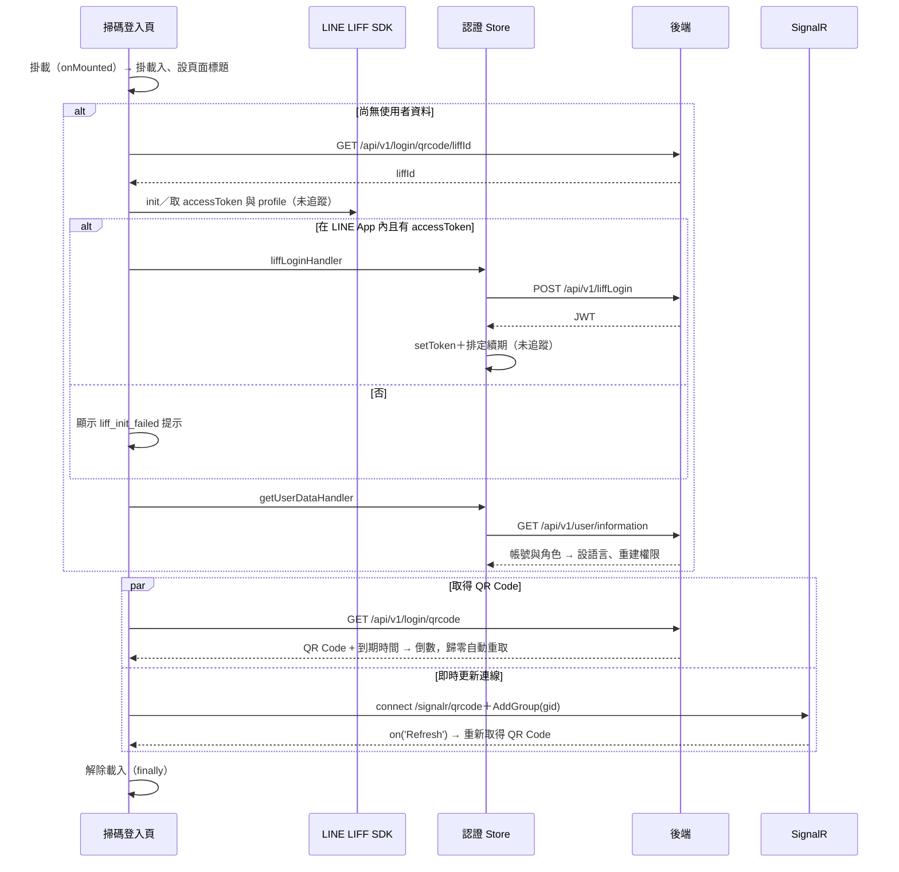

## 掃碼登入頁初始化（LIFF 登入與 QR Code 顯示）

**觸發**：進入掃碼登入頁，元件掛載時自動執行
`src/views/Login/Qrcode/IndexView.vue:156`

這是本域最長的一條鏈（40 個節點）：在 LINE 環境內完成 LIFF 登入、載入使用者資料，
然後同時取得登入 QR Code 與建立即時更新連線。

### 步驟

1. **整段初始化包在 try／finally 裡** `src/views/Login/Qrcode/IndexView.vue:44-62`
   進場先掛上載入狀態，並把頁面標題設成機構名稱
   `src/views/Login/Qrcode/IndexView.vue:48`；結束時無論成敗都解除載入
   `src/views/Login/Qrcode/IndexView.vue:60`。

2. **（僅在尚無使用者資料時）LIFF 登入** `src/views/Login/Qrcode/IndexView.vue:68-85`
   先打 `GET /api/v1/login/qrcode/liffId`（讀取）`src/api/login.ts:176` 取得 liffId，
   交給 LINE LIFF SDK 初始化並取得 accessToken 與使用者 profile（SDK 呼叫解析不到，
   未追蹤）。若在 LINE App 內且拿到 accessToken，交給認證 Store 的
   `liffLoginHandler` `src/stores/auth.ts:159-174`：
   - `POST /api/v1/liffLogin`（**寫入**）`src/api/login.ts:159`，以 LINE accessToken
     換取本系統 JWT；
   - 成功後 `setToken` 存進認證 Store 並解碼 JWT `src/stores/auth.ts:175-178`，
     同時排定 token 到期前的自動續期（`getTokenHandler` 不在封包內，未追蹤）；
   - 失敗則 `setToken(null)` 清空 token，不往外拋錯。

   不在 LINE App 內或初始化失敗時，顯示「liff_init_failed」紅色提示
   `src/views/Login/Qrcode/IndexView.vue:78`、`:81`。

3. **（同樣僅在尚無使用者資料時）載入使用者資料** `src/stores/auth.ts:46-65`
   `GET /api/v1/user/information`（讀取）`src/api/account.ts:39` 取回帳號與角色，
   存進認證 Store 後：
   - 依使用者偏好設定介面語言 `src/stores/language.ts:30-35`——同步 i18n、dayjs，
     並把語言與地圖語言寫進 localStorage（**寫入**）
     `src/utils/composables/useLocalStorage.ts:9`；
   - 重建權限集合 `src/stores/auth.ts:66-75`。

   失敗時把使用者資料設為 null 後繼續往下走，不會中斷初始化。

4. **取得登入 QR Code（與第 5 步並行）** `src/views/Login/Qrcode/IndexView.vue:91-101`
   `GET /api/v1/login/qrcode`（讀取）`src/api/login.ts:171`，顯示 QR Code 並啟動到期
   倒數 `src/views/Login/Qrcode/IndexView.vue:125-139`；倒數歸零會自動重打同一支查詢
   換新的 QR Code。失敗設定 `isQrCodeDataError` 錯誤狀態。

5. **建立 QR Code 即時更新連線（與第 4 步並行）** `src/views/Login/Qrcode/IndexView.vue:105-114`
   使用者 gid 不存在就顯示「login_failed」提示並中止本步。否則建立 SignalR 連線
   `/signalr/qrcode` `src/api/login.ts:180-188`（連線時以認證 Store 的 token 做驗證
   `src/utils/service/websocket.service.ts:13-40`），接著：
   - `invoke('AddGroup', gid)` 加入自己的群組，失敗僅記錄錯誤
     `src/views/Login/Qrcode/IndexView.vue:112`；
   - 訂閱 `Refresh` 事件——收到時重新取得 QR Code（回到第 4 步）
     `src/views/Login/Qrcode/IndexView.vue:113`。

### 序列圖

### 資料變化

| 對象 | 動作 | 位置 |
|---|---|---|
| `POST /api/v1/liffLogin` | **以 LINE accessToken 換取本系統 JWT**（登入） | `src/api/login.ts:159` |
| 認證 Store | 寫入 token／JWT、使用者資料、權限集合 | `src/stores/auth.ts:175-178`、`:46-65`、`:66-75` |
| localStorage（語言） | **寫入**介面語言與地圖語言偏好 | `src/utils/composables/useLocalStorage.ts:9` |
| 頁面標題 | 設為機構名稱 | `src/stores/webTitle.ts:35-37` |
| `GET /api/v1/login/qrcode/liffId`、`/user/information`、`/login/qrcode` | 唯讀 | `src/api/login.ts:176`、`src/api/account.ts:39`、`src/api/login.ts:171` |
| SignalR | 建立連線、AddGroup、訂閱 Refresh | `src/views/Login/Qrcode/IndexView.vue:112-113` |

### 異常與補償

- **整條鏈都在 try 保護內**：初始化最外層是 try／finally，載入狀態一定解除
  `src/views/Login/Qrcode/IndexView.vue:60`。
- **LIFF 登入自成一段 try／catch**：任何一步失敗都收斂成「liff_init_failed」提示
  `src/views/Login/Qrcode/IndexView.vue:81`，不會炸掉整頁。
- **liffLogin 失敗時清空 token**（`setToken(null)`）而不是留下半套狀態
  `src/stores/auth.ts:159-174`。
- **使用者資料查詢失敗不中斷**：`getUserDataHandler` 把失敗 resolve 成 null
  `src/stores/auth.ts:46-65`，後續 QR Code 流程照走（但第 5 步會因無 gid 而顯示
  登入失敗提示）。
- **QR Code 查詢失敗**只設定錯誤旗標 `src/views/Login/Qrcode/IndexView.vue:100`；
  **AddGroup 失敗**只記錄錯誤 `src/views/Login/Qrcode/IndexView.vue:112`。

### 未追蹤的部分

- LINE LIFF SDK 的呼叫（`liff.init`、`liff.getAccessToken`、`liff.getProfile`、
  `liff.isInClient`）解析不到定義，未追蹤。
- `setToken` 後排定的 token 續期 `getTokenHandler` 不在封包內，未追蹤。
- SignalR `Refresh` 事件由後端何時推播，屬伺服器端行為，封包看不到。
- 封包註記鏈中有 17 個呼叫解析不到定義（多為內建方法）。

### 全域前置

API 呼叫會經過〈每個請求送出前〉注入授權與語言標頭，失敗時由〈API 錯誤的全域處理〉接手。
