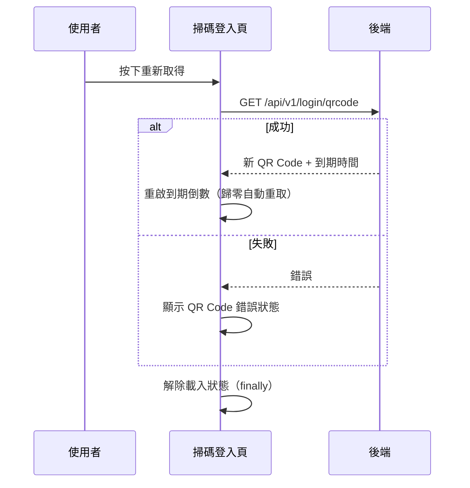

## 掃碼登入頁：手動重新取得 QR Code

**觸發**：掃碼登入頁按下重新取得按鈕
`src/views/Login/Qrcode/IndexView.vue:233`

此流程為純查詢，不改後端資料；QR Code 的自動取得與更新見〈掃碼登入頁初始化〉。

### 步驟

1. **重新取得登入 QR Code** `src/views/Login/Qrcode/IndexView.vue:91-101`
   掛上載入狀態後呼叫 `GET /api/v1/login/qrcode`（讀取）`src/api/login.ts:171`，
   把新的 QR Code 與到期時間寫進頁面狀態。

2. **重啟到期倒數** `src/views/Login/Qrcode/IndexView.vue:125-139`
   先停掉舊的倒數計時器再重新起算；倒數歸零時會**自動再打一次同一支查詢**
   換新的 QR Code（遞迴回到第 1 步）。

3. **失敗則顯示錯誤狀態、無論成敗解除載入** `src/views/Login/Qrcode/IndexView.vue:100`
   `.catch` 設定 `isQrCodeDataError` 旗標；載入解除寫在 `.finally()`。

### 序列圖

### 資料變化

| 對象 | 動作 | 位置 |
|---|---|---|
| `GET /api/v1/login/qrcode` | 唯讀，取得新的登入 QR Code | `src/api/login.ts:171` |
| 載入 Store | 掛上後於 finally 解除 | `src/views/Login/Qrcode/IndexView.vue:92`、`:100` |

### 異常與補償

- **查詢有 `.catch`**：失敗設定 `isQrCodeDataError`，頁面顯示錯誤狀態，
  本流程自行收掉錯誤。
- 倒數計時器每次重取前都會先清掉舊的 `src/views/Login/Qrcode/IndexView.vue:140-145`，
  不會累積多個計時器。

### 全域前置

API 呼叫會經過〈每個請求送出前〉注入授權與語言標頭。
