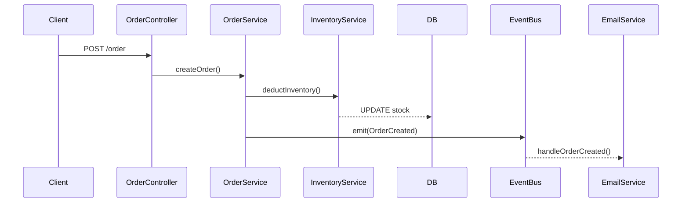

# 業務流程手冊自動生成 Agent — 專案計畫書

> 目標：讀取 TypeScript/JavaScript 程式碼庫，自動追蹤各業務流程的執行路徑，生成以「系統流程」為主軸的完整教學手冊（含步驟敘述、序列圖、資料變化、異常處理）。

---

## 1. 專案概述

### 1.1 目標

不同於 CodeWiki 偏向「元件相依性」的靜態結構文件，本專案要產出的是**動態的業務流程手冊**——回答「使用者觸發某個操作後，系統依序發生了什麼」。

| 面向 | CodeWiki（元件相依） | 本專案（業務流程） |
|---|---|---|
| 分析單位 | 檔案 / class / 模組 | 一條 use case 的執行路徑 |
| 圖的主軸 | 依賴圖、import graph | 流程圖、序列圖（跨檔案時序） |
| 追蹤方向 | 靜態結構 | 從 entry point 順著呼叫鏈往下追 |
| 核心產出 | 「這個模組是什麼」 | 「使用者做 X 時，系統依序發生 A→B→C」 |

一句話：**元件相依是靜態的空間關係，業務流程是動態的時間序列。**核心能力是 call chain tracing，而非 dependency graph。

### 1.2 技術棧前提

- 目標程式碼：TypeScript / JavaScript（Node / 前端生態）
- 非同步比重：中等（有部分 event / queue / message，需接回非同步斷點）
- 前提假設：目標專案具備 `tsconfig.json` 且型別大致完整，Type Checker 才能準確解析呼叫目標

### 1.3 關鍵技術決策

**採用 TypeScript Compiler API（以 `ts-morph` 封裝）作為主要解析引擎，而非純 tree-sitter。**

理由：追 call chain 最大的難點是「這個方法呼叫實際指向哪個定義」——同名方法、interface 實作、import alias、re-export。純 tree-sitter 只提供語法樹，無法解析 symbol 綁定。`ts-morph` 內建：

- **Type Checker**：`getDefinitionNodes()` 直接解析呼叫指向的實際定義（跨檔案、跨 import）
- **`findReferences()`**：反向找出呼叫者
- Interface → implementation 的解析

tree-sitter 保留給 fallback 情境（非 TS 檔案、template、鬆散 JS）。

---

## 2. 整體架構

```
┌──────────┐   ┌──────────┐   ┌──────────┐   ┌──────────┐   ┌──────────┐
│  索引層   │ → │ Entry偵測 │ → │ Chain追蹤 │ → │ 非同步接合 │ → │ LLM生成  │
└──────────┘   └──────────┘   └──────────┘   └──────────┘   └──────────┘
  ts-morph      模式匹配        DFS+邊界        emit/on對應      流程手冊
  載入專案      掃entry point    停止條件         表join         Markdown+Mermaid
```

處理流程：

1. 載入專案（ts-morph Project）
2. 偵測 entry points（每個 ≈ 一條業務流程）
3. 從每個 entry point 追同步 call chain（DFS + 邊界停止）
4. 補接非同步斷點（event / queue 的發送 ↔ 訂閱）
5. 收集整條 chain 的程式碼 → 交給 LLM 還原業務語意

---

## 3. 分階段實作計畫

> 落地原則：**前三步（結構化資料抽取）決定品質，LLM 只是把結構化資料翻成人話。** 依序驗證，不要一開始就接 LLM。

### 階段一：專案載入 + Entry Point 偵測

**目標**：列出所有業務流程入口（此步本身即產出手冊目錄）。

TS/Node 專案的流程起點特徵：

- HTTP route：Express/Fastify 的 `app.post()` / `router.get()`，或 Nest 的 `@Get`/`@Post` 裝飾器
- 訊息消費者：`@EventPattern`/`@MessagePattern`/`@OnEvent` 裝飾器
- 排程：`@Cron`/`@Interval`
- 前端 action / API 呼叫層

**驗收標準**：對目標 repo 跑一次，能正確列出所有 entry point 清單，人工抽查無明顯遺漏。

### 階段二：同步 Call Chain 追蹤（核心）

**目標**：從每個 entry function 出發，DFS 展開呼叫鏈，用 Type Checker 解析每個呼叫指向的實際定義。

兩個關鍵子函式：

**`resolveCallTarget`** — 把呼叫解析成實際定義（tree-sitter 做不到的部分）
- 用 symbol 的 declarations 找出實際的 method/function
- 遇到 interface 多實作（如 `PaymentGateway` → `StripeGateway`/`PaypalGateway`），用 `getImplementations()` 取回全部候選，**不硬選**，交由 LLM 於生成時說明「依注入/設定決定」

**`detectBoundary`** — 決定何時停止往下追（避免追進 library 深處爆炸）

停止條件原則：**追到「跨越一個有意義的系統邊界」就停**，並記錄該邊界：

| 邊界類型 | 判斷特徵 | 手冊意義 |
|---|---|---|
| `DB` | `.query/.save/.find/.insert/.update/.delete()` | 資料如何變化 |
| `EXTERNAL_API` | `fetch/axios/httpService.` | 外部互動點 |
| `EVENT_OUT` | `emit/publish/send/dispatch()` | 非同步斷點（階段三接回） |
| `LIBRARY` | target 位於 node_modules | 停止，不追細節 |

同時需處理：`visited` 集合防止遞迴環路、`MAX_DEPTH` 深度上限。

**驗收標準**：手動選一至兩條流程，逐節點檢查追蹤結果是否正確（呼叫目標解析對、邊界停在合理位置）。

### 階段三：非同步斷點接合

**目標**：把同步鏈在 `emit("OrderCreated")` 斷掉的地方接起來。

作法：掃全專案建立兩份索引——

- `emitters`：所有 `eventBus.emit("X")` 的位置
- `listeners`：所有 `@OnEvent("X")` / `eventBus.on("X")` 的位置

以事件名稱字串 join，將 subscriber 的 handler 視為新的 sub-chain，遞迴回階段二的追蹤流程。

完整流程樹範例：

```
[同步鏈] createOrder → validateStock → deductInventory → emit("OrderCreated")
                                                             ⇣ (async link)
[子鏈]                             handleOrderCreated → sendEmail / updateAnalytics
```

**已知弱點**：動態事件名稱（如 `emit(`order.${type}`)`）無法 join，需標記為「動態事件，待人工確認」。務實策略是先覆蓋字串常數約 90% 的情況。

**驗收標準**：含至少一個 event 的流程能正確接出子鏈。

### 階段四：LLM 生成業務語意

**目標**：把 chain tree（含邊界標記、非同步連結、原始碼）序列化，交由 LLM 產出手冊。

要求 LLM 輸出：

1. 步驟化業務敘述（每步：做什麼、動到哪些資料、為什麼）
2. 分支與例外處理（如庫存不足 / 付款失敗如何 rollback）
3. Mermaid `sequenceDiagram`（強調時序與跨物件互動）
4. 每步對應的 `file:line`（防幻覺，可驗證）

**Prompt 核心規則**：只根據提供的程式碼，不臆測未出現的邏輯；不確定的分支明確標註。

序列圖範例：



---

## 4. 手冊產出結構

```
├─ 系統總覽（有哪些業務流程）
├─ 流程一：下單
│   ├─ 觸發條件與前置
│   ├─ 步驟拆解（含序列圖）
│   ├─ 資料變化（哪些表被寫入）
│   ├─ 異常與補償
│   └─ 相關程式碼位置（file:line）
├─ 流程二：退款
└─ ...
```

輸出格式：Markdown → 靜態站（Astro / VitePress）。

---

## 5. 關鍵風險與對策

| 風險 | 影響 | 對策 |
|---|---|---|
| 型別不完整的鬆散 JS | `resolveCallTarget` 命中率下降 | 退回向量語意檢索當 fallback |
| Interface 多型無法靜態決定實際走向 | 流程分支不準 | `getImplementations()` 取全部候選，交 LLM 說明 |
| 動態事件名稱 | 非同步鏈接不起來 | 標記「待人工確認」，先覆蓋字串常數 |
| Call chain 追蹤慢（findReferences 吃 CPU） | 大專案效能差 | 快取 chain 結果，以檔案 hash 判斷失效，增量重生 |
| LLM 幻覺 | 手冊內容失真 | 強制引用 file:line，生成後對照 AST 驗證符號存在 |
| Context 爆量（大流程） | 無法單次生成 | 階層式摘要，過長流程拆段生成 |

---

## 6. 技術選型

| 元件 | 選項 | 備註 |
|---|---|---|
| TS/JS 解析 | ts-morph（TypeScript Compiler API 封裝） | 核心，負責 symbol resolution |
| Fallback 解析 | tree-sitter | 非 TS 檔案、鬆散 JS |
| Orchestration | LangGraph / 自寫 state machine | 管理 agent loop |
| 向量庫（fallback 檢索） | Qdrant / pgvector / LanceDB | 型別不足時補語意檢索 |
| LLM | Claude（長 context 適合整鏈理解） | |
| 輸出站 | Astro / VitePress | |
| CI 整合 | GitHub Actions | 對接既有 CI/CD，diff 觸發增量重生 |

---

## 7. 里程碑

| 里程碑 | 交付物 | 對應階段 |
|---|---|---|
| M1 | 可載入專案並列出完整 entry point 清單（＝手冊目錄） | 階段一 |
| M2 | 單條同步流程 call chain 追蹤正確 | 階段二 |
| M3 | 含 event 的流程能接出非同步子鏈 | 階段三 |
| M4 | 端到端：一條流程從程式碼到 Markdown 手冊 + 序列圖 | 階段四 |
| M5 | 全 repo 批次生成 + CI 增量更新（檔案 hash 快取） | 整合 |

---

## 8. 落地建議

1. **先把 M1、M2 跑通再碰 LLM。** 結構化資料的品質是天花板，LLM 無法補救追錯的 chain。
2. **善用測試作為輸入。** 若專案有整合測試，測試案例往往就是業務流程的最佳說明，一併餵給 agent 可大幅提升準確度。
3. **混合輸入。** 現成的 API 文件、DB schema 若存在，一起提供給生成階段。
4. **快取優先。** 追 chain 比呼叫 LLM 還慢，務必在早期就設計好以檔案 hash 為 key 的快取與增量重生。